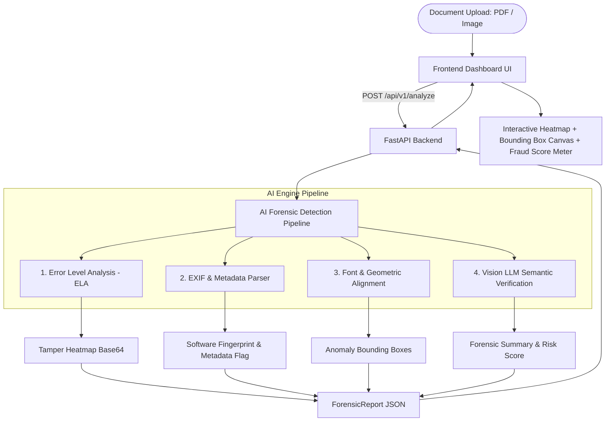

# 🔍 SherDetect - AI Document Fraud & Forgery Detection

> **24-Hour Hackathon Winning Architecture** | Problem Statement: AI Fraud & Forgery Detection in Documents (Financial Statements, IDs, Legal Contracts, Invoices, Payslips)

---

## 🎯 Overview
**SherDetect** is an enterprise-grade, multi-layered AI forensic system designed to detect document manipulation, forgery, font inconsistencies, pixel splicing, and metadata tampering in real-time.

---

## 📐 API Contract & Schema Architecture (`/contracts`)

All teams (Frontend, Backend, AI Engineering) use **`contracts/api-spec.ts`** as the **Single Source of Truth**.

### Core Data Models

#### 1. `AnomalyBoundingBox`
Bounding box coordinates expressed in **percentages (0 - 100)** relative to document dimensions for responsive UI rendering over any screen size.

```typescript
export interface AnomalyBoundingBox {
  x: number;          // percentage (0 - 100) from left
  y: number;          // percentage (0 - 100) from top
  width: number;      // percentage (0 - 100)
  height: number;     // percentage (0 - 100)
  label: string;      // e.g., "Pixel Splicing", "Font Inconsistency"
  confidence: number; // 0.0 to 1.0
}
```

#### 2. `ForensicReport`
Complete forensic audit report returned by the backend after document processing.

```typescript
export interface ForensicReport {
  documentId: string;
  isAuthentic: boolean;
  fraudRiskScore: number; // 0 (Safe) to 100 (Critical Fraud)
  verdict: "VERIFIED_AUTHENTIC" | "SUSPICIOUS" | "FORGERY_DETECTED";
  forensicBreakdown: {
    elaScore: number; // Error Level Analysis score (0 - 100)
    metadataTampered: boolean;
    softwareFingerprintDetected?: string; // e.g., "Adobe Photoshop CS6", "Canva"
    semanticDiscrepancy: boolean;
  };
  detectedAnomalies: AnomalyBoundingBox[];
  tamperHeatmapBase64?: string;
  forensicSummary: string;
  processingTimeMs: number;
}
```

---

## 🚀 24-Hour Hackathon Role Breakdown & Roadmap



### 1. 💻 Frontend Role Tasks
- **UI Components**:
  - Drag-and-drop file upload container supporting PDF/PNG/JPEG.
  - **Interactive Bounding Box Canvas**: Render responsive overlays using percentage-based `AnomalyBoundingBox` coordinates (`x`, `y`, `width`, `height`).
  - **Heatmap Toggle Layer**: Overlay `tamperHeatmapBase64` on top of the original document image.
  - **Fraud Score Meter & Badge**: Dynamic color-coded gauge (Green for `VERIFIED_AUTHENTIC`, Amber for `SUSPICIOUS`, Crimson for `FORGERY_DETECTED`).
  - **Forensic Breakdown Panel**: Displays ELA Score, Metadata tampering status, Software Fingerprints, and AI summary.
- **Immediate Start**: Use `contracts/mock-data.ts` to build and test full UI without waiting for backend.

### 2. ⚡ Backend Role Tasks
- **FastAPI Infrastructure**:
  - `POST /api/v1/analyze`: Accepts multipart document file upload (`file: UploadFile`).
  - `GET /api/v1/health`: Health check endpoint.
  - CORS middleware enabled for local frontend development.
- **Schemas**: Import Pydantic model from `contracts/api_spec.py`.
- **Pipeline Orchestration**: Receive image/PDF -> invoke AI Forensic Engine -> construct `ForensicReport` payload -> send response.

### 3. 🧠 AI Engineer Role Tasks
- **Multi-layered Forensic Engine (`ai_engine/`)**:
  - **Error Level Analysis (ELA)**: Re-encode image at 90% JPEG quality, compute absolute pixel difference, highlight high-frequency noise areas (splicing/copy-paste).
  - **Metadata & Software Fingerprinting**: Parse EXIF/XMP tags using `PyPDF2` / `ExifTool` / `PIL.ExifTags` to detect editing software signatures.
  - **Visual & Font Inconsistency Detection**: Detect bounding boxes where text style, alignment, or background noise abruptly changes.
  - **Multimodal AI Semantic Verification**: Pass image to Gemini 1.5 / Vision Model to audit calculation errors, mismatched bank logos, altered numbers, or suspicious formatting.

---

## 🛠️ Repository Layout
```
SherDetect/
├── contracts/             # Shared API Contracts & Mock Fixtures (Single Source of Truth)
│   ├── api-spec.ts        # TypeScript Contract Schema
│   ├── api_spec.py        # Python Pydantic Schema (1:1 parity)
│   ├── mock-data.ts       # Mock Data Fixtures for parallel UI dev
│   └── index.ts           # Exports
├── frontend/              # Web Application (Next.js / React / Vite)
├── backend/               # FastAPI Server Engine
└── README.md              # Hackathon Master Plan & Documentation
```

---

## ⚡ Quick Start

```bash
# 1. Clone repository
git clone https://github.com/navisjoshvadonel/SherDetect.git
cd SherDetect

# 2. Frontend setup
cd frontend
npm install
npm run dev

# 3. Backend setup
cd ../backend
pip install -r requirements.txt
uvicorn main:app --reload
```
