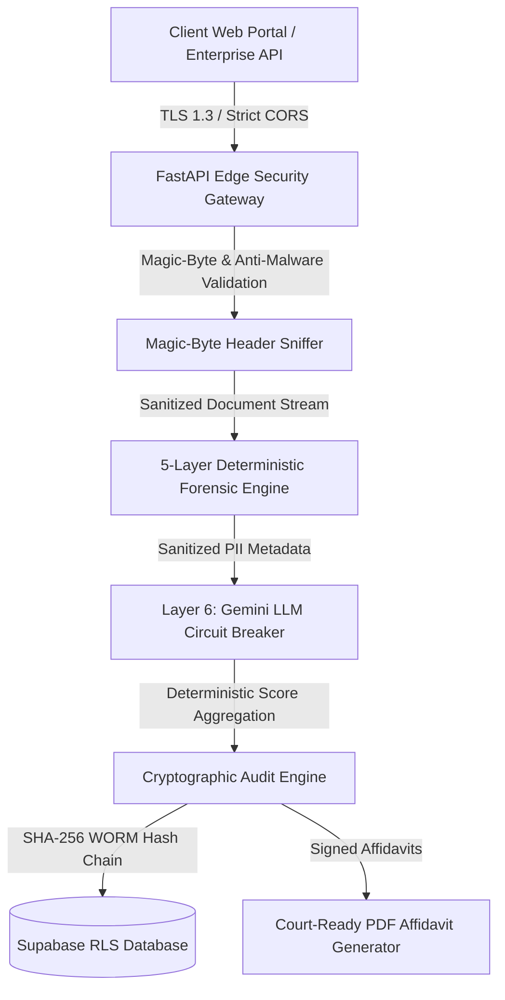

# 🛡️ SherDetect Sovereign Enterprise Security Whitepaper & Trust Center

**Document Version**: 2.0.0  
**Classification**: Public / Enterprise Security & Procurement Review  
**Target Audience**: CISOs, Data Protection Officers (DPOs), Enterprise Security Auditors, and Compliance Teams  

---

## 1. 🏗️ Sovereign Security Architecture Overview

SherDetect is engineered as a **Sovereign, Zero-Trust Document Forensic Platform** designed for multinational enterprise deployments across HR, KYC, Finance, Legal, Academic, and Medical sectors.

---

## 2. 🔄 End-to-End Data Flow Architecture

### 1. Ingestion Phase:
- Documents uploaded via HTTPS (TLS 1.3 only with Perfect Forward Secrecy).
- Ingested files pass through `validate_file_security()`: magic-byte sniffing verifies binary signatures (`%PDF`, `\xFF\xD8\xFF`, `\x89PNG`) to prevent executable rename attacks.

### 2. Forensic Execution Phase:
- **Local Deterministic Analysis**: Layers 1–5 process document bytes purely in-memory. No raw data is saved to unencrypted disk.
- **PII Scrubbing**: Before transmitting data to Layer 6 (Gemini LLM), all PII (names, SSNs, phone numbers, tax IDs) is sanitized via regex & NER transformers.

### 3. Storage & Audit Persistence Phase:
- Audit records are signed with an immutable **SHA-256 Hash Chain** (`previous_hash` linked to prior record).
- Database access is restricted via **Supabase Row Level Security (RLS)** enforcing tenant isolation.

---

## 3. 🔐 Encryption & Secret Management

| Tier | Standard | Implementation |
| :--- | :--- | :--- |
| **Data at Rest** | **AES-256-GCM** | Encrypted PostgreSQL storage volumes & Supabase evidence buckets |
| **Data in Transit** | **TLS 1.3 / HSTS** | Enforced HSTS headers (`max-age=31536000`), `nosniff`, `DENY` frames |
| **Key Management** | **AWS KMS / Vault** | API Keys & Database credentials injected dynamically via environment secret stores |

---

## 4. ⚖️ Compliance & Privacy Controls

- **GDPR Article 17 (Right-to-Erasure)**: `POST /api/privacy/gdpr-erasure` permanently wipes document PII and returns a cryptographic **Deletion Certificate**.
- **GDPR Article 22 (Automated Decisioning)**: `GET /api/documents/{doc_id}/explanation` exposes complete XAI feature attributions for human officer oversight.
- **SOC 2 Type II & ISO 27001**: System controls aligned with Security, Availability, and Confidentiality Trust Services Criteria.
